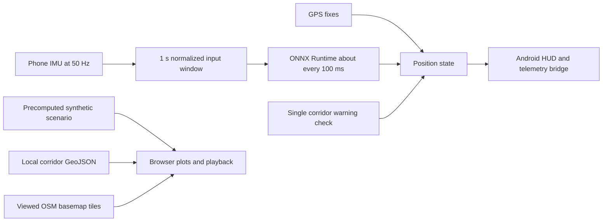

# TrueTrack: Neural-Inertial Navigation Prototype

> **Status:** This repository contains a prototype and an illustrative simulation. It does not establish real-world blackout accuracy, target-device NPU execution, or product readiness. The benchmark paths use synthetic telemetry and ground-truth assistance as described below.

## Problem

Two-wheeler riders often lose usable GNSS in covered roads and urban canyons. Phone accelerometers and gyroscopes provide motion signals during a gap, but sensor bias, vibration, mounting orientation, and heading drift make standalone inertial navigation difficult. This project explores whether a small learned speed/yaw estimator and map context can make that interval easier to reason about.

## What the current prototype implements

- A Kotlin Android app samples accelerometer and gyroscope events with a 50 Hz target interval and builds a one-second, six-channel input window.
- A checked-in FP32 ONNX model estimates forward speed and yaw rate. The app measures elapsed time around `OrtSession.run`; it requests NNAPI where available, but does not verify which execution provider ran the call.
- Live GPS fixes update the Android position. After blackout, the app waits for three fixes that pass simple position/consistency bounds before accepting GPS again.
- `LeanCorrector` estimates roll and can de-roll selected acceleration axes. De-roll defaults off because the checked-in model and normalization stats were trained on uncorrected channels. The Android app does not currently fuse an NHC measurement or a live EKF.
- The Android off-route warning checks against one hardcoded HITEC City centerline. It is not a general routing or multi-corridor map matcher.
- A foreground notification and heartbeat are present. The service does not own the sensor pipeline; sensor processing remains in `MainActivity`.
- The WebSocket bridge streams live phone telemetry to loopback at approximately the model inference cadence. It is telemetry-only and can be reached from a laptop with ADB reverse.
- The browser cockpit replays precomputed synthetic telemetry on local OSM route geometry. Its slider noise and decimation are visual demonstrations, not model re-inference.

## Data and evaluation limits

The repository has three sets of real phone sensor-log CSV captures. The loader can align log streams onto a 50 Hz grid, but the model trainer and checked-in performance outputs do not consume those captures. The model was trained on one synthetic drive. Its stored validation MSE came from a random split of heavily overlapping windows. The trainer now uses a chronological split, a one-second gap, and training-only normalization, but the model, normalization, and ONNX artifacts have not been regenerated with that change.

The drift benchmark is also synthetic. During blackout, the map/full-stack progression uses the per-frame ground-truth position and heading to project the estimate onto the route. The five-seed script perturbs sensor noise on the same synthetic route and uses the same ground-truth-assisted projection. These results are not leak-free or held-out performance estimates. The cornering-results JSON has no generator script in the repository and cannot be reproduced from current tracked code.

For those reasons, this submission does not claim measured drift performance, cross-route generalization, real-world lean benefit, or NPU latency. The web UI labels its values as generated scenario outputs.

## Architecture

The browser downloads standard OSM raster tiles as they are viewed; the basemap therefore requires internet. The Android app uses osmdroid's Mapnik tile source. Historic raster and debug PNGs remain in the repository but are no longer loaded by the current map code.

## Model details

- Architecture: three Conv1D layers with batch normalization and LeakyReLU, followed by a small regressor.
- Input: `[1, 6, 50]`, normalized accelerometer and gyroscope channels.
- Output: forward speed in m/s and yaw rate in rad/s.
- The current file is ordinary FP32 ONNX. Qualcomm QNN compilation, INT8 quantization, and confirmed Hexagon execution are not present.
- Latency shown by Android is elapsed time around the ONNX Runtime call, not a confirmed NPU-only measurement.

## Work needed for a defensible evaluation

1. Train and validate on independent real routes, separating routes before generating windows and fitting normalization statistics only on the training split.
2. Replace ground-truth-driven map progression with route matching based only on the estimate and an independently sourced road graph.
3. Recompute all benchmark artifacts and publish median, mean, and tail errors across held-out routes, with scripts and exact data provenance.
4. Profile the actual Android execution provider and end-to-end inference latency on the target phone.
5. Run disconnect, screen-off/Doze, blackout, and GPS reacquisition tests on a moving device.
6. Add route selection and multi-corridor geometry only after the data format and real route captures are available.

## Demo setup

Serve the browser cockpit locally with `python -m http.server 8000 --directory web_app`. For the Android telemetry bridge over USB, run `adb reverse tcp:8765 tcp:8765` and connect to `localhost:8765`. The bridge sends telemetry only; the browser's Kill GPS control changes the browser simulation, not phone location services.
